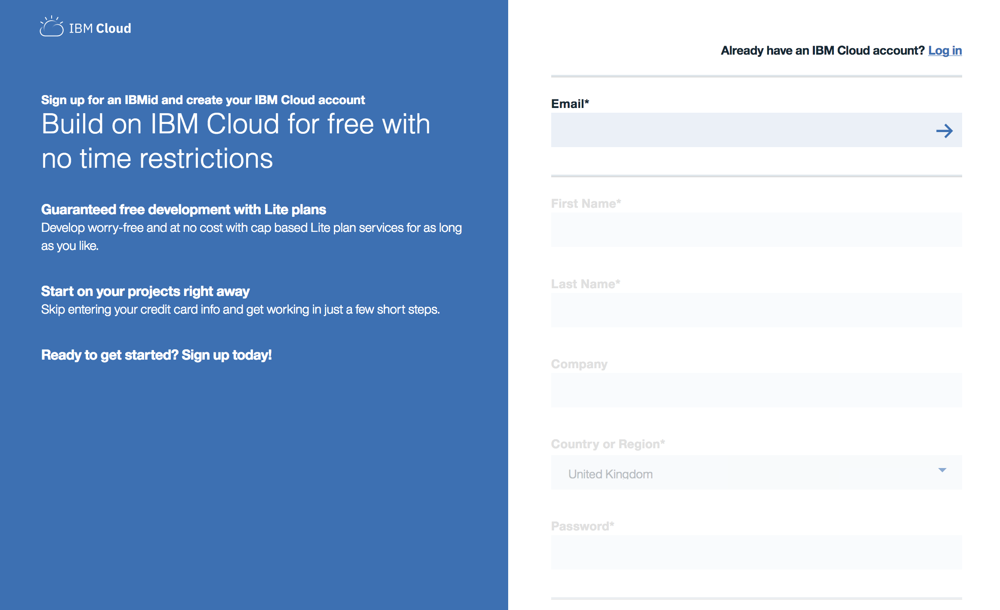
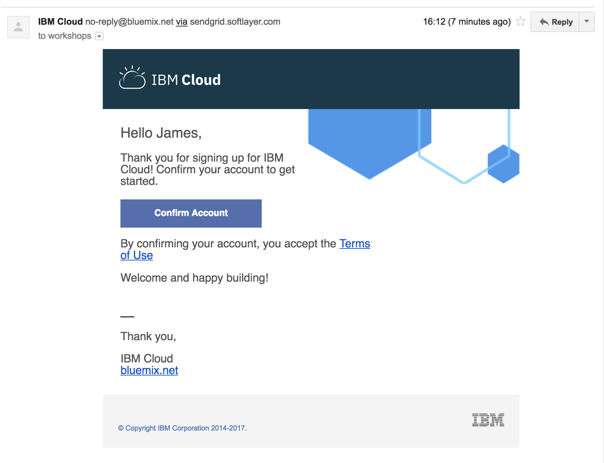

# Подготовка 


Для проведения семинара необходимо иметь следующее
инструменты, установленные на вашем ноутбуке:

-   Любая JDK 8 или новее, например [adoptopenjdk](https://adoptopenjdk.net/?variant=openjdk8&jvmVariant=openj9)
 
-   [Maven 3](https://maven.apache.org/download.cgi)

-   [curl](https://curl.haxx.se/download.html) 

-   [IBM Cloud CLI](https://cloud.ibm.com/docs/cli?topic=cli-getting-started), включая
    плагины kubernetes-service и container-registry

-   [istioctl (version
    1.6.0)](https://istio.io/docs/setup/getting-started/#download) (необходимо только загрузить istioctl и добавить в PATH)
    
    
Следующие инструменты также необходимы и будут установлены вместе с IBM Cloud CLI.
    
-   [git](https://git-scm.com/book/en/v2/Getting-Started-Installing-Git)

-   [docker](https://docs.docker.com/install/)

-   [kubectl](https://kubernetes.io/docs/tasks/tools/install-kubectl/)

## Проверка


Чтобы проверить, выполните следующие команды в вашем терминале: 
- `git version`
- `curl -iL https://www.ibm.com`
- `docker run --rm hello-world`
- `kubectl version` (версия клиента должна соответствовать)
- `istioctl version` (версия клиента должна соответствовать)

### Регистрация учетной записи IBM Cloud

Откройте окно браузера и перейдите 
<https://cloud.ibm.com/registration>.



Заполните регистрационную форму и перейдите по ссылке из письма на
электронную почту для подтверждения.



Затем вы можете [войти в IBM Cloud](https://cloud.ibm.com/login) используя ваши учетные данные.

> **Примечание**
>
> IBM Cloud предлагает бесплатный тип Kubernetes кластера, который будет работать в течении 30
> дней. Вы можете использовать этот тип, как только подключили
> банковскую карту или ввели соответвтующий промо-код.

### IBM Cloud CLI

Вход в IBM Cloud CLI: `ibmcloud login`. Если у вас федеративный аккаунт, используйте `--sso` флаг: `ibmcloud login --sso`.

Создайте API ключ для более удобного доступа в IBM Cloud CLI.
```
ibmcloud iam api-key-create cloud-native-starter \
    -d "cloud-native-starter" \
    --file cloud-native-starter.json

cat cloud-native-starter.json
```
Вставьте API ключ ниже в `apikey` параметр.

Теперь мы устанавливаем locale и отменяем конфигурацию, которая может существовать, 
если вы использовали CLI в прошлом:
```
ibmcloud config --locale en_US

ibmcloud config --check-version=false

ibmcloud api --unset

ibmcloud api https://cloud.ibm.com

ibmcloud login --apikey <yourkey> -r eu-de
```
Чтобы убедиться, что плагины установлены правильно, запустите
`ibmcloud plugin list`. Container Service plugin и Registry plugin 
отображены как `container-service/kubernetes-service` и `container-registry`.

## IBM Kubernetes Service


Теперь мы создаем наш кластер Kubernetes (бесплатный или стандартный) используя [Cloud
Console](https://cloud.ibm.com/kubernetes/catalog/create) или CLI. 
Для этого семинара достаточно бесплатного кластера, но вы можете создать
стандартный кластер с желаемой конфигурацией.

Если вы хотите использовать CLI, перейдите к одной из следующих команд:

Для бесплатного кластера используйте:
```
ibmcloud ks cluster create classic  \
    --name cloud-native
```
Для стандартного кластера, включающего 3 рабочих узла используйте: 

```
ibmcloud ks cluster create classic \
    --name cloud-native \
    --zone fra02 \
    --flavor b3c.4x16 \
    --workers 3
```

> **Примечание**
>
> Если команда не выполнена из-за того, что вы имеете другие VLANs в этой зоне, 
> вам необходимо указать VLAN в вашей команде:
```
ibmcloud ks vlans --zone fra02

ibmcloud ks cluster create classic \
    --name cloud-native \
    --zone fra02 \
    --flavor b3c.4x16 \
    --workers 3 \
    --private-vlan <vlan> \
    --public-vlan <vlan>
```
### Доступ к кластеру

Теперь посмотрим, как настроить контекст для работы с нашими кластерами, используя 
`kubectl` CLI, получить доступ к панели управления Kubernetes и собрать основную 
информацию о нашем кластере.

Список доступных кластеров: `ibmcloud ks clusters`. Эта команда должна показать ваш 
кластер, который создается.

После запуска кластера, загрузите файл конфигурации и сертификаты для кластера, используя 
команду `cluster config`:
```
ibmcloud ks cluster config --cluster cloud-native
```
Получите основную информацию о кластере и его рабочих узлах. Эта
информация понадобится при управлении кластером и решенни проблем с ним.

Получить информацию о вашем кластере:

`ibmcloud ks cluster get --cluster cloud-native`

Проверить узлы в кластере:
```
ibmcloud ks workers --cluster cloud-native

kubectl get nodes
```
Просмотр доступных на данный момент сервисов, развертываний и модулей(services, deployments, pods):
```
kubectl get svc,deploy,po --all-namespaces
```
### Установка Istio

Теперь мы устанавливаем Istio:
```
istioctl manifest apply --set profile=demo
```
Это установит Istio 1.6.0 с распределенной трассировкой, Grafana и Kiali.

Убедитесь, что все модули работают, прежде чем продолжить.
```
kubectl get pod -n istio-system
```
Мы можем проверить нашу Istio установку следующим образом:
```
istioctl manifest generate --set profile=demo > generated-manifest.yaml

istioctl verify-install -f generated-manifest.yaml
```
Результат второй команды (последние 3 строки) выглядит так:
```
Checked 25 crds
Checked 3 Istio Deployments
Istio is installed successfully
```
Затем мы включаем автоматический sidecar injection:
```
kubectl label namespace default istio-injection=enabled
```
Это включит автоматический sidecar injection для `default` namespace.

Поздравляем! Мы успешно установили Istio в наш кластер.

### Container Registry

Для создания и распостранения образов Docker нам нужен Docker реестр. 
Мы можем использовать IBM Container Registry к которому можно получить доступ
прямо из нашего кластера Kubernetes.

Войдем в Container Registry service с помощью `ibmcloud` CLI и получим 
информацию о нашем реестре:
```
ibmcloud cr login

ibmcloud cr region-set eu-central

ibmcloud cr region
You are targeting region 'eu-central', the registry is 'de.icr.io'.
```
Воспользуемся CLI, чтобы создать уникальное пространство имен в Container Registry
service (`cr`) для нашего семинара:
```
ibmcloud cr namespace-add cee-<your-name>-workshop
ibmcloud cr namespaces
```
Чтобы протестировать новое пространство имен реестра, давайте загрузим какой-нибудь Docker image, например, `hello-world`, 
изменим его тег на соотвтетствующий нашему реестру, и загрузим image в реестр:
```
docker pull hello-world

docker tag hello-world de.icr.io/cee-<your-name>-workshop/hello-world:1

docker push de.icr.io/cee-<your-name>-workshop/hello-world:1
```
Проверим, есть ли наш image в реестре:
```
ibmcloud cr images
```
> **Примечание**
>
> Во всех следующих примерах вам нужно будет адаптировать имена image-ей/namespace-ов
>  Это важно учитывать, в противном случае примеры не будут работать, так как image-ей 
>  нет в вашем реестре.
> 

Мы закончили подготовку! Давайте начнем [семинар](01-introduction.md).
